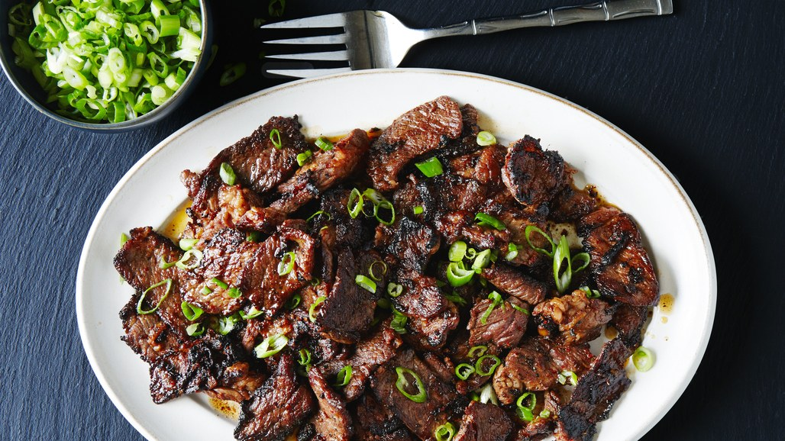

# Basic Bulgogi

## Ingredients
- ¼ pear, grated
- 1 garlic clove, grated
- 2 tablespoons soy sauce
- 1 tablespoon gochugaru (coarse Korean hot pepper flakes), or 1 teaspoon crushed red pepper flakes
- 1 tablespoon grated peeled ginger
- 1 tablespoon light brown sugar
- 1 tablespoon toasted sesame oil
- 1 pound
  * boneless pork loin,
  * trimmed hanger steak, boneless short rib, or
  * skinless, boneless chicken breasts or thighs
- 2 tablespoons vegetable oil, divided
- Kosher salt
- Sliced scallions (for serving)

## Directions
1. Combine pear, garlic, soy sauce, gochugaru, ginger, sugar, and sesame oil in a large resealable plastic bag or medium bowl.
2. Using a sharp knife, slice meat into very thin strips.
3. Add to marinade, seal bag, and squish everything around until the meat is coated. Let sit at room temperature 30 minutes, or chill up to 8 hours.
4. Heat 1 Tbsp. vegetable oil in a large skillet over medium-high until oil is shimmering.
5. Remove half of meat from marinade, letting excess drip back into bag;
6. season lightly with salt and cook in a single layer without moving until lightly browned, about 1 minute.
7. Toss meat and continue to cook, tossing occasionally, until cooked through and crisp at edges, about 3 minutes.
8. Transfer to a plate.
9. Repeat with remaining 1 Tbsp. vegetable oil, remaining meat, and more salt.

Serve topped with scallions.
