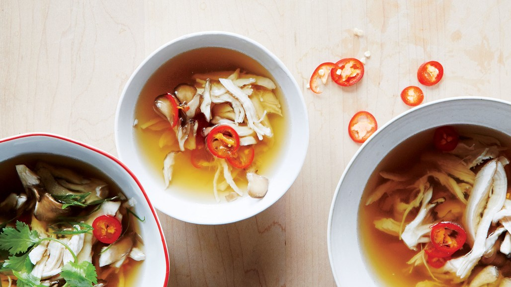

# Brothy Poached Chicken with Mushrooms and Fresh Chile

## Ingredients
- 1½ pounds boneless, skinless chicken breasts (about 3 large)
- 1 head garlic, halved crosswise
- 2 bay leaves
- 4 whole allspice
- 1½ teaspoons kosher salt, plus more
- 8 ounces maitake or shiitake mushrooms, torn into bite-size pieces
- 1 fresh red chile (such as Fresno), thinly sliced
- 1 1” piece ginger, peeled, finely chopped
- 1 tablespoon distilled white vinegar
- 1 tablespoon soy sauce
- Freshly ground black pepper
- Sliced scallions and cilantro sprigs (for serving)

## Directions
1. Place chicken, garlic, bay leaves, allspice, and 1½ tsp. salt in a medium pot.
2. Cover with 6 cups water and bring to a bare simmer over high heat.
3. Immediately reduce heat to medium-low, cover pot, and cook 8 minutes.
4. Remove chicken from liquid and let cool slightly, then shred into bite-size pieces.
5. Strain stock through a fine-mesh sieve into a clean pot; discard solids.
6. Add mushrooms, chile, ginger, vinegar, and soy sauce to stock.
7. Bring to a boil; reduce heat and simmer, stirring occasionally, until broth tastes rich and flavorful, 8–10 minutes.
8. Season with salt and pepper
9. Add shredded chicken and simmer just until meat is warmed through.  

Divide soup among bowls and serve topped with scallions and cilantro.
