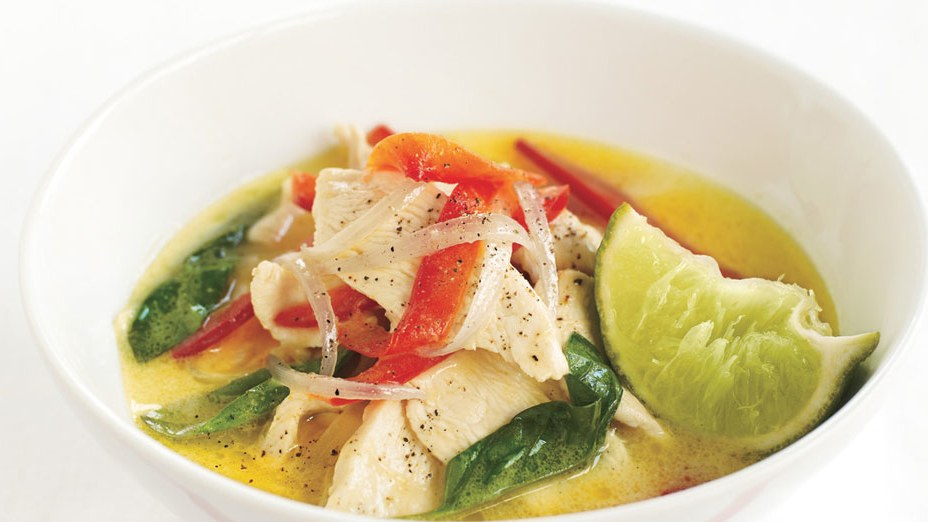

# Thai Green Chicken Curry

## Ingredients

- 1 tablespoon vegetable oil
- 3/4 cup sliced shallots (about 5 large)
- 1 3/4 teaspoons Thai green curry paste
- 1 14-ounce can unsweetened coconut milk
- 2 teaspoons fish sauce (such as nam pla or nuoc nam)*
- 1 pound skinless boneless chicken breast halves, cut into thin strips
- 1 large red bell pepper, cut into strips
- 1/4 cup chopped fresh basil plus sprigs for garnish
- 2 tablespoons fresh lime juice plus wedges for garnish

## Directions
1. Heat oil in large saucepan over medium heat.
2. Add shallots and curry paste; stir until shallots soften, about 2 minutes.
3. Add coconut milk and fish sauce; bring to boil.
4. Add chicken and bell pepper; stir until chicken is just cooked through.
5. Stir in chopped basil and lime juice.
6. Season to taste with salt and pepper.

Divide curry among bowls. Garnish with basil sprigs and lime wedges.
